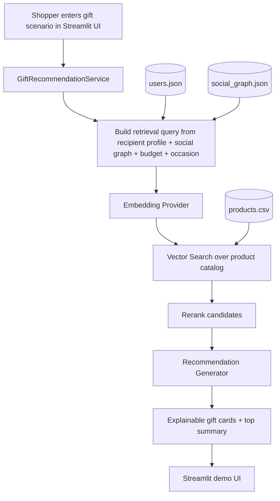

# rag-gift-recommendation-system
RAG-based gift recommendation system that combines semantic retrieval with social context. Instead of generic recommendations, it uses a friend’s purchase history, browsing behavior, and style embeddings to retrieve relevant products, and then uses an LLM to generate personalized, explainable recommendations

# RAG E-commerce Gift Recommendation System

A portfolio-ready prototype that demonstrates how Retrieval-Augmented Generation (RAG) can improve gift recommendations for e-commerce.

Instead of showing generic “people also bought” results, this project combines:
- semantic retrieval over a product catalog
- recipient style and purchase signals
- social closeness context
- occasion + budget constraints
- explainable recommendation generation

The result is a lightweight demo you can show in interviews, on GitHub, or in a product portfolio.

---

## Demo concept

**User story**  
_As a shopper buying a gift for a friend, I want personalized suggestions based on that friend’s style, browsing behavior, and occasion, so I can confidently choose a gift._

**Example output**  
“Since your friend has recently browsed graphic hoodies and buys oversized streetwear, this vintage wash denim jacket is a strong fit for their style and stays within your birthday budget.”

---

## What makes this project different

This is not just a recommendation engine and not just an LLM wrapper.

It demonstrates a practical AI product pattern:
1. Retrieve relevant structured and unstructured product context.
2. Rerank results with business logic.
3. Generate explainable outputs for the shopper.

That makes it suitable for:
- e-commerce AI portfolio demos
- Product Manager interview walkthroughs
- RAG architecture discussions
- MVP conversations around explainability and user trust

---

## Architecture diagram

### Mermaid diagram



---

## Repository structure

```text
rag-gift-recommendation-system/
├── data/
│   ├── products.csv
│   ├── users.json
│   └── social_graph.json
├── docs/
│   └── architecture_diagram.svg
├── src/
│   ├── config.py
│   ├── data_loader.py
│   ├── embeddings.py
│   ├── vector_store.py
│   ├── retriever.py
│   ├── generator.py
│   └── service.py
├── .streamlit/
│   └── config.toml
├── api.py
├── streamlit_app.py
├── PM_PROJECT_STORY.md
├── requirements.txt
├── .env.example
└── README.md
```

---

## How it works

### 1) Context assembly
The system builds a retrieval query using:
- recipient style preferences
- favorite colors
- browsing history
- purchase history
- social closeness score
- occasion
- budget range

### 2) Retrieval
The product catalog is converted into searchable text and embedded. The system then retrieves the most semantically relevant candidate products.

### 3) Reranking
Retrieved results are reranked using:
- style overlap with recipient preferences
- budget fit
- occasion fit
- social closeness weighting

### 4) Generation
The top products are passed to a generator layer that creates:
- one top summary
- explanation cards for each recommendation

If an OpenAI key is available, the generator can use an LLM. Otherwise it falls back to a deterministic rule-based explanation engine, which keeps the prototype easy to run.

---

## Tech stack

- **Python**
- **Streamlit** for demo UI
- **FastAPI** for API layer
- **Pandas / NumPy** for data handling
- **Sentence Transformers** for embeddings
- **Scikit-learn** fallback for TF-IDF retrieval
- **OpenAI (optional)** for natural-language generation

---

## Run locally

### 1) Clone the repo

```bash
git clone <your-repo-url>
cd rag-gift-recommendation-system
```

### 2) Create a virtual environment

```bash
python -m venv .venv
source .venv/bin/activate
```

On Windows:

```bash
.venv\Scripts\activate
```

### 3) Install dependencies

```bash
pip install -r requirements.txt
```

### 4) Optional: configure environment variables

```bash
cp .env.example .env
```

Add `OPENAI_API_KEY` if you want the LLM generation path.

### 5) Launch Streamlit demo

```bash
streamlit run streamlit_app.py
```

### 6) Run the API

```bash
uvicorn api:app --reload
```

---

## API example

### Request

```bash
curl -X POST http://127.0.0.1:8000/recommend \
  -H "Content-Type: application/json" \
  -d '{
    "gifter_id": "U100",
    "recipient_id": "U101",
    "occasion": "birthday",
    "min_budget": 20,
    "max_budget": 80,
    "top_k": 5
  }'
```

### Response shape

```json
{
  "query": "Gift recommendation for birthday...",
  "context": {"gifter": {}, "recipient": {}, "relationship": {}},
  "retrieved_products": [
    {
      "product_id": "P004",
      "title": "Pastel Knit Cardigan",
      "retrieval_score": 0.88
    }
  ],
  "generated_recommendation": {
    "summary": "Top pick for Sofia...",
    "cards": [
      {
        "title": "Pastel Knit Cardigan",
        "reason": "Matches soft pastel style..."
      }
    ],
    "model_used": "rule-based generator"
  }
}
```

---

## Product thinking behind the MVP

This project is intentionally framed like a PM portfolio piece.

### Product hypothesis
Shoppers convert faster when gift recommendations are:
- more personally relevant
- constrained by the shopping scenario
- explained in plain language

### MVP scope
- small synthetic catalog
- small synthetic user graph
- semantic retrieval
- reranking logic
- explainable recommendation output
- demo UI

### Out of scope for MVP
- real-time inventory APIs
- live social platform integrations
- production-grade experimentation pipeline
- personalization model training loop

---

## Roadmap improvements

### Retrieval improvements
- add hybrid search: semantic + keyword + collaborative filtering
- store retrieval metadata in a real vector database such as Chroma, FAISS, or Pinecone
- include trend signals and seasonality

### Product improvements
- add thumbs up / thumbs down feedback loop
- capture recommendation acceptance rate
- support price sensitivity and shipping urgency
- support “gift by vibe” flows like cozy, trendy, luxury, practical

### Model improvements
- use CLIP or image embeddings for visual style retrieval
- add prompt templates by occasion
- evaluate recommendation quality with offline relevance labels

---

## Suggested interview explanation

> I built a RAG-based gift recommendation prototype for e-commerce. The system retrieves products based on the recipient’s style, browsing history, purchase signals, social closeness, occasion, and budget, then generates explainable recommendations rather than generic ranking outputs. I designed it as an MVP that balances personalization, transparency, and conversion-oriented product thinking.

---

## Why this is portfolio-ready

This repo shows:
- AI product thinking
- RAG architecture understanding
- recommendation-system intuition
- UX awareness through explainability
- practical demo delivery through Streamlit

That makes it useful for Product Manager, Product Owner, AI Product, and platform strategy discussions.

---

## License

Use this as a portfolio and learning project. Add your preferred license before publishing publicly.

